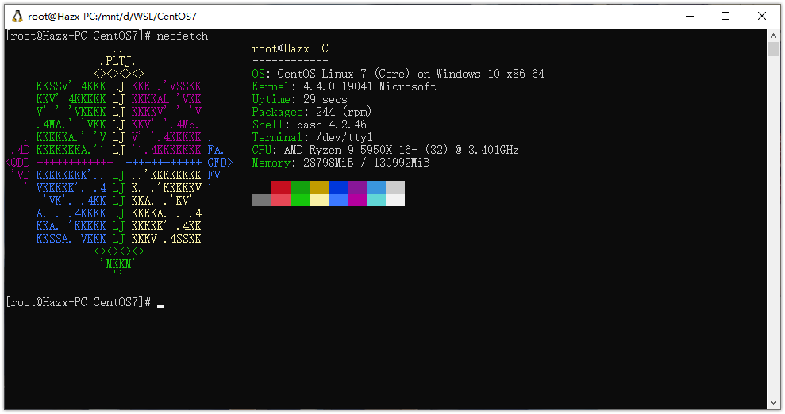
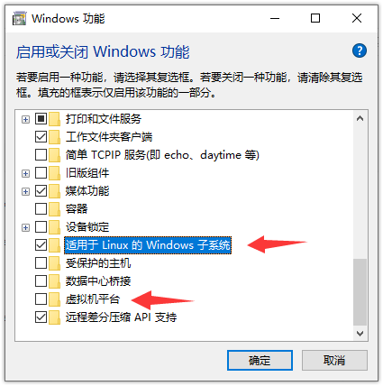

# WSL-CentOS 7

这是一个用于Windows Subsystem for Linux（WSL）的 CentOS 7 自定义镜像。你也可以通过修改脚本来构建适合于你自己使用的自定义WSL镜像。

已构建好的镜像文件请至 **Releases** 下载，使用方法请参阅 [安装WSL镜像](#安装WSL镜像)。



# 文件说明

- script：用于自定义WSL镜像内容的脚本。你可以修改此文件来打包更多的功能。
- start_make.sh：用于控制整个构建过程的脚本。

# 构建镜像

> 用于构建镜像的 Linux 环境需要提前安装 Docker，并能够联网。

1. 切换账户（已是root账户可跳过此步）
```shell
sudo -i
```

2. 运行脚本
```shell
chmod +x start_make.sh && ./start_make.sh
```
脚本运行结束后会生成镜像包 `rootfs.tar.gz`，将此文件拷出来即可。

# 安装WSL镜像

> 用于安装 WSL 镜像的 Windows 10 必须高于 `2004` 版本。需要开启 Windows 功能【适用于 Linux 的 Windows 子系统】，若想启用WSL2则还需开启【虚拟机容器】。



1. 在 C 盘或其他盘符下新建文件夹，名字不能带空格和特殊符号，这里以 D 盘下的 `CentOS` 文件夹为例

2. 将镜像包 `rootfs.tar.gz` 拷贝至此文件夹中。

3. 启动带有**管理员权限**的命令提示符（CMD），并进入此文件夹

```batch
D:
cd CentOS
```

4. 在 CMD 中执行以下命令，将镜像导入WSL

```batch
wsl --import CentOS7 .\ .\rootfs.tar.gz
```

`--import` 后的3个参数分别为 WSL 系统名称（可自定义）、安装目录、镜像路径

5. 到第4步就已经完成了。此处介绍一些可用于WSL管理的命令。

> 以下命令仅针对 Windows 10（版本 `2004` 及以上）。Windows 11 的命令参数相似但有所不同。

- 查询已安装的 WSL：
```batch
wsl --list
```
- 手动启动到某个 WSL：
> WSL 可以安装多个，但除了默认 WSL 外，都需要使用此命令启动。
```batch
wsl -d CentOS7
```
- 将某个 WSL 设为默认：
> 在 CMD 或 Powershell 中执行 `wsl` 或 `bash` 时默认调用的 WSL
```batch
wsl -s CentOS7
```
- 卸载某个 WSL：
```batch
wsl --unregister CentOS7
```